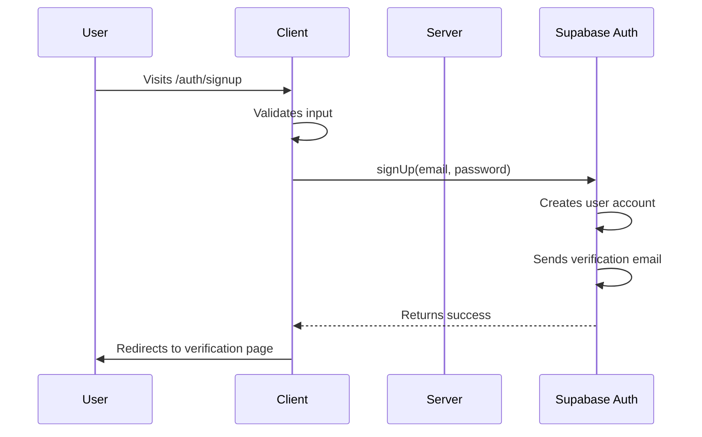
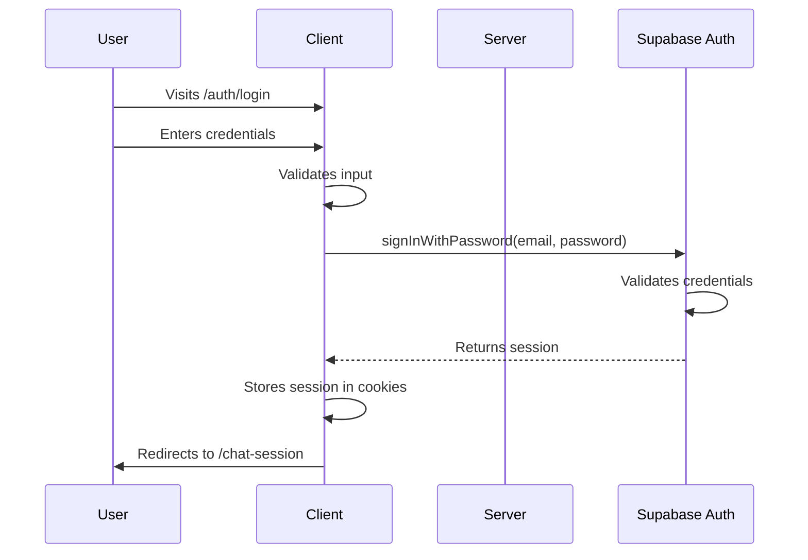
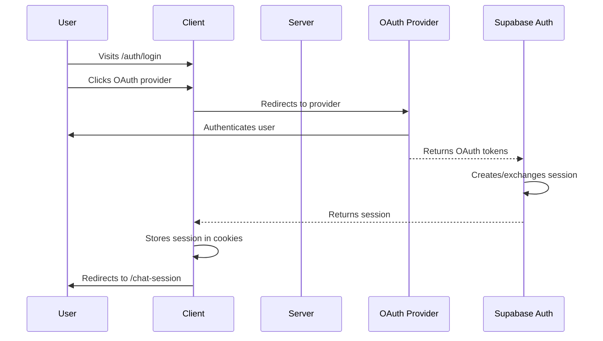
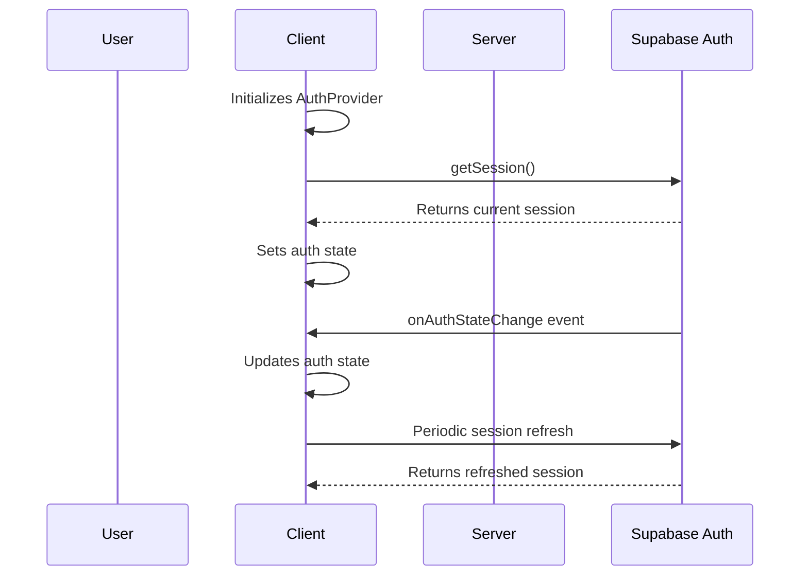
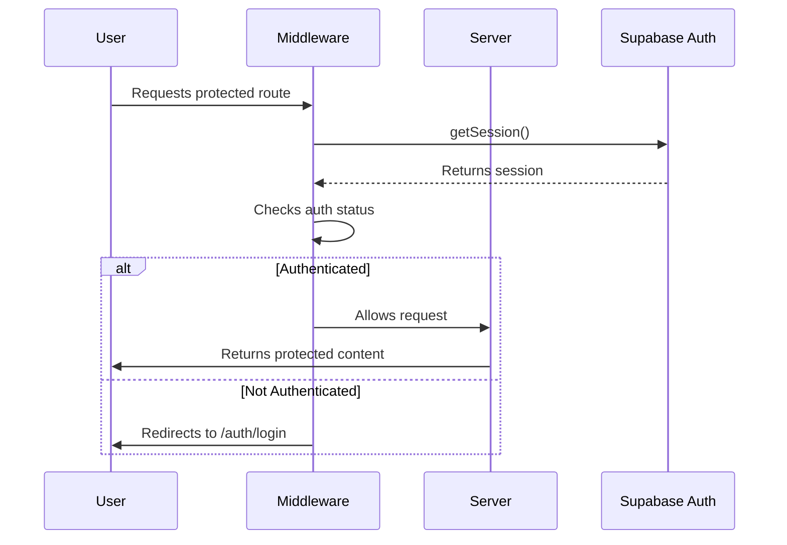

# End-to-End Authentication System

This document provides a comprehensive overview of the complete authentication system implemented in the AI Chat application. This system demonstrates a production-ready, secure authentication solution built with Supabase Auth.

## Table of Contents

1. [System Overview](#system-overview)
2. [Architecture](#architecture)
3. [Key Components](#key-components)
4. [Authentication Flows](#authentication-flows)
5. [Security Features](#security-features)
6. [Implementation Details](#implementation-details)
7. [Testing Strategy](#testing-strategy)
8. [Deployment Considerations](#deployment-considerations)

## System Overview

The authentication system provides a complete solution for user authentication and authorization with the following features:

- Email/password authentication
- OAuth integration (Google, GitHub, Discord)
- Session management with automatic refresh
- Protected route handling
- API endpoint protection
- Role-based access control
- Comprehensive error handling
- Security best practices

## Architecture

The system follows a layered architecture:

```
┌─────────────────────────────────────────────────────────────┐
│                    Client-Side (Browser)                    │
├─────────────────────────────────────────────────────────────┤
│  React Hooks & Context Providers                           │
│  - useAuth hook for authentication state                   │
│  - AuthContext for global state management                 │
├─────────────────────────────────────────────────────────────┤
│                    Server-Side (Next.js)                    │
├─────────────────────────────────────────────────────────────┤
│  Middleware & Server Functions                             │
│  - Authentication middleware for route protection          │
│  - Server-side auth service for SSR pages                  │
│  - API route protection                                    │
├─────────────────────────────────────────────────────────────┤
│                    Database Layer                           │
├─────────────────────────────────────────────────────────────┤
│  Supabase Auth                                             │
│  - User management                                         │
│  - Session handling                                        │
│  - OAuth integration                                       │
│  - Row Level Security (RLS)                                │
└─────────────────────────────────────────────────────────────┘
```

## Key Components

### 1. Authentication Service (`src/lib/auth-service.ts`)

Centralized server-side authentication functions:

- `createServerClient()` - Creates Supabase client for server operations
- `getSession()` - Retrieves current user session
- `getUser()` - Retrieves current user
- `protectApiRoute()` - Protects API endpoints
- `checkAuth()` - Server-side auth check with redirect
- `checkGuest()` - Server-side guest check

### 2. Authentication Hook (`src/hooks/useAuth.ts`)

Client-side React hook for authentication state management:

- Real-time session updates
- Email/password authentication
- OAuth integration
- Error handling
- Loading states
- Automatic redirect handling

### 3. Authentication Context (`src/contexts/AuthContext.tsx`)

Global authentication state provider:

- Wraps entire application
- Provides consistent auth API
- Handles session persistence

### 4. Authentication Middleware (`src/lib/auth-middleware.ts`)

Server-side route protection:

- Session validation
- Route-based access control
- Redirect handling
- Permission checking

### 5. Protected Layout (`src/app/chat-session/layout.tsx`)

Layout component for protected routes:

- Server-side authentication validation
- Automatic redirect for unauthenticated users

## Authentication Flows

### 1. User Registration Flow



### 2. Email/Password Login Flow



### 3. OAuth Login Flow



### 4. Session Management Flow



### 5. Protected Route Access Flow



## Security Features

### 1. Session Security

- HttpOnly, Secure cookies
- Automatic token refresh
- PKCE flow for OAuth
- Session expiration handling

### 2. Password Security

- Minimum 8 characters with complexity requirements
- Server-side validation
- Secure storage with Supabase Auth

### 3. Database Security

- Row Level Security (RLS) policies
- Service role key only used on server
- Anon key only used on client

### 4. Communication Security

- HTTPS enforcement in production
- Secure headers
- Content Security Policy (CSP)

### 5. Rate Limiting

- Authentication endpoint protection
- OTP request limiting
- Brute force protection

### 6. Input Validation

- Email format validation
- Password strength requirements
- Sanitization to prevent injection attacks

## Implementation Details

### Client-Side Implementation

The client-side implementation uses React hooks and context providers:

```typescript
// Using the authentication hook
import { useAuth } from '@/hooks/useAuth';

function LoginComponent() {
  const { 
    signInWithPassword, 
    signInWithOAuth, 
    loading, 
    error 
  } = useAuth();
  
  const handleLogin = async (email: string, password: string) => {
    try {
      await signInWithPassword(email, password);
      // Redirect handled automatically
    } catch (err) {
      // Error handling
    }
  };
}
```

### Server-Side Implementation

The server-side implementation uses middleware and service functions:

```typescript
// Protecting a server component
import { checkAuth } from '@/lib/auth-service';

export default async function ProtectedPage() {
  const { user } = await checkAuth();
  // User is guaranteed to be authenticated
  return <div>Welcome, {user.email}!</div>;
}

// Protecting an API route
import { protectApiRoute } from '@/lib/auth-service';

export async function GET(request: Request) {
  const authResult = await protectApiRoute(request);
  
  if (!authResult.success) {
    return new Response(
      JSON.stringify({ error: authResult.error }),
      { status: authResult.status }
    );
  }
  
  // User is authenticated
  return new Response(JSON.stringify({ data: 'Protected data' }));
}
```

### Middleware Implementation

The middleware handles route protection:

```typescript
// Authentication middleware
export async function authMiddleware(request: NextRequest) {
  const supabase = createServerClient(
    process.env.NEXT_PUBLIC_SUPABASE_URL!,
    process.env.NEXT_PUBLIC_SUPABASE_ANON_KEY!,
    { /* cookie handling */ }
  );

  const { data: { session } } = await supabase.auth.getSession();

  // Protected routes
  const protectedPaths = ['/chat-session', '/profile'];
  const isProtectedPath = protectedPaths.some(path => 
    request.nextUrl.pathname.startsWith(path)
  );

  if (!session && isProtectedPath) {
    // Redirect to login
    const url = request.nextUrl.clone();
    url.pathname = '/auth/login';
    return NextResponse.redirect(url);
  }

  return NextResponse.next();
}
```

## Testing Strategy

The authentication system includes comprehensive testing:

### Unit Tests

- Authentication service functions
- Hook functionality
- Middleware logic
- Error handling

### Integration Tests

- Authentication flows
- Session management
- Route protection
- API endpoint protection

### End-to-End Tests

- User registration journey
- Login/logout flows
- Protected route access
- OAuth integration

### Security Testing

- Penetration testing
- Vulnerability scanning
- Session security validation
- Input validation testing

## Deployment Considerations

### Environment Variables

```env
# Supabase Configuration
NEXT_PUBLIC_SUPABASE_URL=your_supabase_project_url
NEXT_PUBLIC_SUPABASE_ANON_KEY=your_supabase_anon_key
SUPABASE_SERVICE_ROLE_KEY=your_supabase_service_role_key

# OAuth Configuration
GOOGLE_CLIENT_ID=your_google_client_id
GOOGLE_CLIENT_SECRET=your_google_client_secret
GITHUB_CLIENT_ID=your_github_client_id
GITHUB_CLIENT_SECRET=your_github_client_secret
```

### Production Security

- HTTPS enforcement
- Secure cookie settings
- Content Security Policy
- Rate limiting
- Monitoring and logging

### Performance Optimization

- Session caching
- Middleware optimization
- Lazy loading of auth components
- Code splitting

## Conclusion

This end-to-end authentication system provides a comprehensive, secure, and scalable solution for the AI Chat application. It demonstrates best practices in authentication design, implementation, and security while maintaining a great user experience.

The system is designed to be extensible, allowing for easy addition of new authentication methods, permission levels, and security features as the application grows.